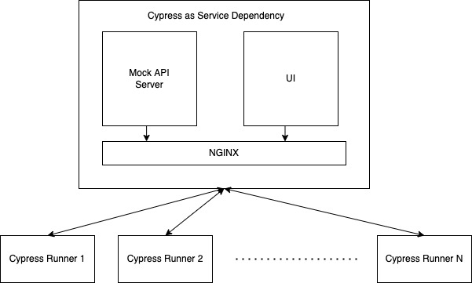

# Cypress tests for harness-core-ui

## Running tests locally

For running cypress locally, multiple terminal instances are required.

1. Under `cypress` directory, run `yarn install` to install dependencies. You can skip this step if you have already installed the dependencies.
2. In a seperate terminal, run `yarn dev:cypress` under root of the project, to start webpack build.
3. In a seperate terminal, under `cypress` directory, run `yarn server`, to start a proxy server.
4. In a seperate terminal, under `cypress` directory, run `yarn cypress:open`

After this, you should see

## Running tests on CI

**How parallel runs are configured on CI?**

1. A base (docker) image is created using `Dockerfile` from `./docker` folder. Lets call this `BaseImage`. This image has all the packages/tools required to run cypress on CI. This is done only when there is a change in config.
2. Given a commit, a second image is created using the `BaseImage` as a staring point and `cypress.Dockerfile` as config. Lets call this as `TestImage`. The image is tagged using the "Build Id" of the CI pipeline. This image has all the (cypress) tests, compiled code for `harness-core-ui` and mock API server. All of this is linked together via a nginx server.
3. The `TestImage` is used as a ["Service depenedency"](https://docs.harness.io/article/rch2t8j1ay-ci-enterprise-concepts#service_dependencies) and also to run the test cases in parallel.
4. Once the run is complete, `TestImage` is deleted.

The following diagram gives an illustartion of how Cypress is configured:



## Updating node and browser versions

`BaseImage` is based on [cypress/browsers](https://github.com/cypress-io/cypress-docker-images/tree/master/browsers) docker image.

For example, let us assume that you want to add a new version `node16.5.0-chrome97-ff96`. Then you need to follow the steps mentioned below:

1. Make a duplicate of existing Dockerfile from `./docker` folder and name it using the new tag. i.e `node16.5.0-chrome97-ff96.Dockerfile`.
2. Update the `FROM` statement using the new tag

```diff
-FROM cypress/browsers:node14.16.0-chrome90-ff88
+FROM cypress/browsers:node16.5.0-chrome97-ff96
```

3. Save the file and push it GitHub. You may also need to get it merged to develop.
4. Now run [this pipeline](https://app.harness.io/ng/#/account/vpCkHKsDSxK9_KYfjCTMKA/ci/orgs/default/projects/NextGenUI/pipelines/Cypress_Base_Image/executions) to build and publish the images to registry.
5. Now you can update `cypress.Dockerfile` to use the required image as base image.
