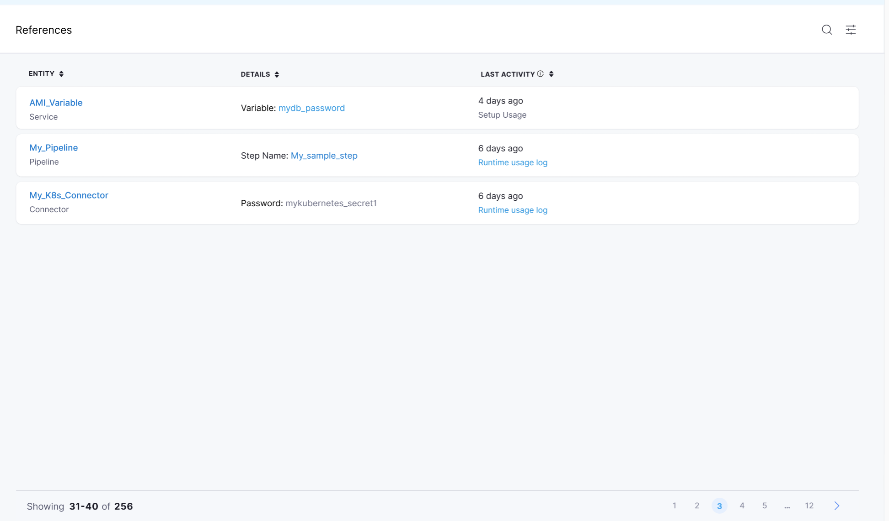

# Resource Details View and Action Framework

The purpose of creating this _Resource detail view and Action_ framework is to register the different resource type corresponding to its UI component(i.e React component containing view and action) on the basis of props passed to it. It should be implemented by the owner of different resource teams which can be used on platform UI if registered.

This is two steps process of **Resources Details View and Action framework**: Registration and Consumption.

**Registration**: In this step,resource owner team will register their resource types. Currently we have below two categories
(1) REFERRED BY ENTITY - types (eg. Secret, Project, Pipeline, Connector etc.)
(2) REFERRED ENTITY USAGE DETAIL IN REFERRED BY ENTITY- types (eg. SecretReferredByConnectorSetupUsageDetail etc)

Below should be taken care by respective resource team

- This registration should be implement at [module](https://github.com/wings-software/nextgenui/blob/master/src/modules/README.md) level.

Example of REFERRED BY ENTITY registration(Dummy):

```typescript
import ResourceDetailFactory from '@common/factories/ResourceDetailFactory'

ResourceDetailFactory.registerReferredByEntityTypeHandler('Connectors', {
  getResourceDetailViewAndAction: props => <ConnectorDetailViewAndAction {...props} />
})
```

**Note**

- Component <ConnectorDetailViewAndAction {...props} /> will contain the actual UI elements implementation which needs to render on UI on the basis of below sample props:-

```json
{
  "referredByEntity": {
    "type": "Connectors",
    "entityRef": {
      "scope": "project",
      "identifier": "awstest5",
      "accountIdentifier": "kmpySmUISimoRrJL6NL73w",
      "orgIdentifier": "default",
      "projectIdentifier": "dheerajsecretusage",
      "metadata": {}
    },
    "name": "aws-test5"
  }
}
```

Example of REFERRED ENTITY USAGE DETAIL IN REFERRED BY ENTITY registration(Dummy):

```typescript
import ResourceDetailFactory from '@common/factories/ResourceDetailFactory'

ResourceDetailFactory.registerReferredEntityUsageDetailTypeHandler('SecretReferredByConnectorSetupUsageDetail', {
  getResourceDetailViewAndAction: props => <SecretUsageDetailViewAndAction {...props} />
})
```

**Note**

- Component <SecretUsageDetailViewAndAction {...props} /> will contain the actual UI elements implementation which needs to render on UI on the basis of below sample props:-

```json
{
  "referredEntity": {
    "type": "Secrets",
    "entityRef": {
      "scope": "project",
      "identifier": "HARNESS_IMAGE_PASSWORD",
      "accountIdentifier": "kmpySmUISimoRrJL6NL73w",
      "orgIdentifier": "default",
      "projectIdentifier": "dheerajsecretusage",
      "metadata": {}
    },
    "name": ""
  },
  "referredByEntity": {
    "type": "Connectors",
    "entityRef": {
      "scope": "project",
      "identifier": "awstest5",
      "accountIdentifier": "kmpySmUISimoRrJL6NL73w",
      "orgIdentifier": "default",
      "projectIdentifier": "dheerajsecretusage",
      "metadata": {}
    },
    "name": "aws-test5"
  },
  "detail": { "type": "SecretReferredByConnectorSetupUsageDetail", "fieldName": "secretKeyRef" }
}
```

**Consumption**: In this step platform UI will consume below:-

(1) REFERRED BY ENTITY
(2) REFERRED ENTITY USAGE DETAIL IN REFERRED BY ENTITY

Below should be taken care by Platform team

Example of REFERRED BY ENTITY consumption(Dummy):

```typescript
import ResourceDetailFactory from '@common/factories/ResourceDetailFactory'

const chkResourceDetailTypeHandler = ResourceDetailFactory.getReferredByEntityTypeHandler('Connectors')
if (chkResourceDetailTypeHandler) return chkResourceDetailTypeHandler.getResourceDetailViewAndAction({ props })
else {
  // Render normal data without hyperlink
}
```

Example of REFERRED ENTITY USAGE DETAIL IN REFERRED BY ENTITY consumption(Dummy):

```typescript
import ResourceDetailFactory from '@common/factories/ResourceDetailFactory'

const chkResourceDetailTypeHandler = ResourceDetailFactory.getReferredEntityUsageDetailTypeHandler(
  'SecretReferredByConnectorSetupUsageDetail'
)
if (chkResourceDetailTypeHandler) return chkResourceDetailTypeHandler.getResourceDetailViewAndAction({ props })
else {
  // Render no data
}
```

**EntityUsage**: We have also build up a common component for Entity usage which will display the below sub components:-
(a) Page title with search feature
(b) Table grid which will display all the references of Entity
(c) Pagination feature

Hence, to use EntityUsage component for different entity type please use below code :-

```typescript
import EntitySetupUsage from '@common/pages/entityUsage/EntityUsage'
;<EntitySetupUsage entityType={'Secrets'} entityIdentifier={secretId} />
```

Below is the screen shot of Entity setup usage reference detail page



- For more details of Factory, kindly refer [ResourceDetailFactory](https://github.com/wings-software/nextgenui/blob/master/src/modules/10-common/factories/ResourceDetailFactory.tsx)
